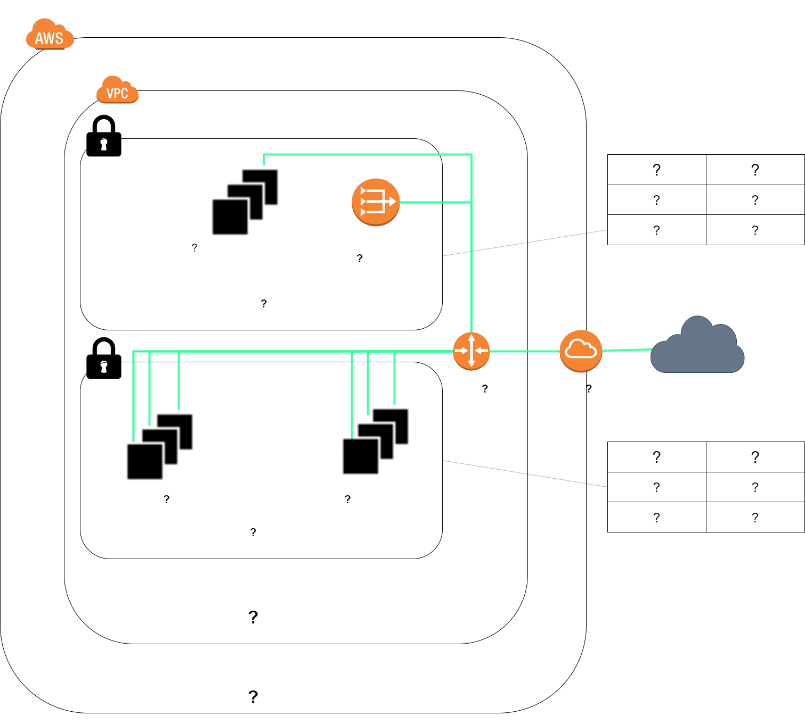

<!-- This template removes the micro tutorial for a quicker post and removes images for a full template check out the 000-DAY-ARTICLE-LONG-TEMPLATE.MD-->

**Add a cover photo like:**

# Infastructure As Code 

## Building Reusable code

Think I've explained this before in my first post when I started this journey. If I have to do it more than once, I am going to automate the process!

Today was mainly spent on further reading about Terraform, and applying the knowledge that I already know into my first "mini" project. 

These days, its increasingly crucial to automate your infastructure as applications can be deployed into production  hundred of times per day. In additiona, infastructure is fleeting and can be provisioned or deprovisioned in response to load. 

Let's say you're building an application, and you've chosen a public cloud, lets say AWS. We've decided to build our application in Kubernetes (don't die from this one folks), so we'll have a Kubernetes application stack. Next, let's say after a week of development, we decide to bring in a VM that hosts legacy application that hasn't been modernized yet. In order to connect those two together, we'll need to use a virtual private cloud (VPC).

So now, we have a pretty simple infastructure in place. Now, we develop this, everything is great, everything is documented, wonderful and now its ready to begin to be moved into a test phase. In best practices, we should create a whole new environment that mimics the dev environment that we created. To do so, let's recall and look into the documentation that we made while setting up the environment. But, what if I forget to document one of the configs, or the platform is different on how it handles provisioning the infastructure... Regardless, the two environments are not the same. 

So how do we fix this problem? Infastructure as code. 

## Introducing Terraform!

- Infrastructure as Code (IaC) is the process of managing and provisioning servers through machine-readable definition files. 
- Rapidly build dev/ test environments 
- Similar to cloudformation, however is agnostic and supports various cloud providers
- written in GO, syntax being HashiCorp Configuration Language (HCL)
- State files stores information about real world resources of your configuration -  outputted in JSON. 

## Okay, What's the next step?

Well, not to spoil too much for the next day, however- Let's automate a lab environment!

Here's a small sneak peak to see what's in store for the next day. 

## Social Proof

[Linkedin](https://www.linkedin.com/posts/markus-mabson-86917a133_100daysofcloud-activity-6702976115050332160-xC_r)
