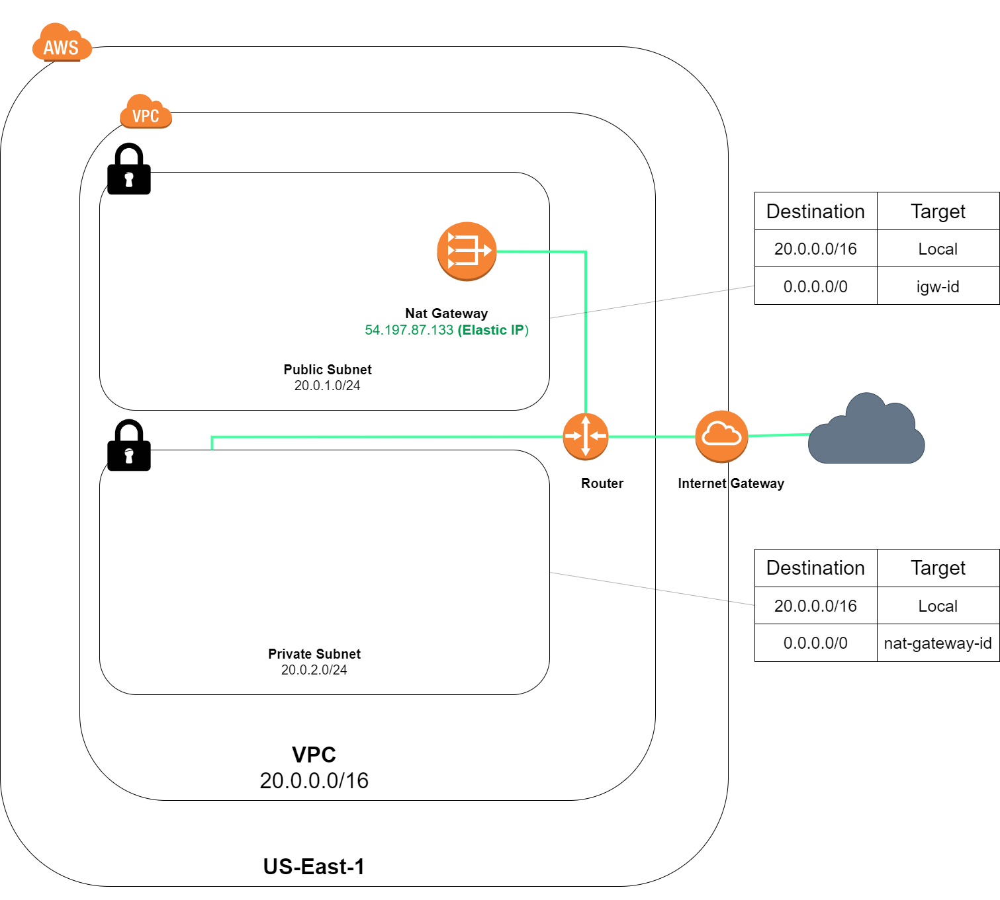

# Terraform - creating a Lab Environment

## Introduction

Today's mini project was to be able to stand up a lab environment via  Terraform, so whenever I'm ready to spin up my lab network configuration for my lab environment, I can do so without hanving to have the envinroment up 24/7 which accrues costs from AWS.

With Terraform, the goal was to create the following through the use of code:
- Virtual Private Cloud (VPC)
- Route Tables (public/private)
- Route Table Assosciations 
- Internet Gateway 
- Elastic IP
- Nat Gateway 

## Environment



## Dependencies
- Terraform Binaries installed (https://www.terraform.io/downloads.html)
- AWS Account 

## Use Case


Infrastrucute as Code (IAC) means writing code to manage configurations and automate provisionining of infrastrucutre in addition to deployments. Essentially, think of writing code to proision and amnager your server, while automating the process. This allows for a rapid deployment of environments without the need of going through multiple pages of documentation and inputting commands into your server. 

## Cloud Research

For references in how to utilize specific terraform modules, please visit the link below.

https://registry.terraform.io/

# Terraform 
Terraform is an IAC that is offered from HashiCorp that is a tool for building, changing, as well as managing infrastructure in a repeatable way. 

State files are created when a project is first initialized, and is referenced to create plans and make changes to your infrastructure. Prior to a change, Terraform does a refresh to update the state with the real world resources. Terraform compares those changes with the state file, to determine whether or not to create a new resource or adjust a particular resource.

https://www.terraform.io/

# Walkthrough

## Variables file 

Here, I'm defining a list of variables that I will be referencing in the vpc file. 
```
variable "aws_region" {
    description = "region of AWS"
    default = "us-east-1"
}

variable "lab_tag" {
    description = "tagging purposes for cost allocation"
    default = "labVPC"
}

variable "project" {
    description = "tagging purposes for cost allocation"
    default = "lab"
}
variable "lab_cidr"{
    description = "CIDR for VPC"
    default = "20.0.0.0/16"
}

variable "lab_public_subnet" {
    description = "public subnet for lab "
    default = "20.0.1.0/24"
}

variable "lab_private_subnet" {
    description = "private subnet for lab"
    default = "20.0.2.0/24"
}
```


## main file
Since we're utilizing AWS, we'll be calling the provider for that cloud. The provider is responsible for understanding API interactions as well as exposing resources. 

We're choosing the region that we'll be using which was defined in our variables file , and using a credentials file that I created for the LabAccount. Instead of exposing my Access/ Secret keys to the world (I highly recommend you do not upload secrets to GitHub) I've created a config file on my local machine and reference my secrets that way. If you wish to use your own credentials, an easy way is to remove the profile line and input your own secrets. 


```
provider "aws" {
    region = var.aws_region
    profile = "LabAccount"
    #access_key = " "
    #secret_key = " " 
}
```

## VPC 

One of the first resources that we created in the terraform script is allocating a CIDR block for the virtual private cloud(VPC). A VPC is an on-demand configurable pool of shared computing resources allocated within any public cloud environment. 

In this case, we're calling a resource block callled `aws_vpc` and giving it a local name called `labVPC`. The name is used to refer to this resource from elsewhere within the same Terraform module. The resource type and name together server as an identifier for a given resoruce and must be unique with the module. 

We're defining a `cidr_block` that was defined in our variables file and we're allowing dns support to be active within the VPC. 

Finally, we're tagging the instance with the variables defined in the variable file, as well as assosciating a tag of `project` for cost allocation reasons. 

```
resource "aws_vpc" "labVPC" {
    cidr_block       = var.lab_cidr
    instance_tenancy = "default"
    enable_dns_support = "true"
    enable_dns_hostnames = "true"
    tags = {
        Name = var.lab_tag
        project = var.project
  }
}
```

## Subnets
Next, we're defining our two subnets, one for the public subnet which we will allow for reachabillity through the open internet, and a private subnet which will not be accessible through the internet, because we're not defining a route to the internet gateway. 

Below, we're creating a resource module named `lab-public_subnet` & and `lab_private_subnet` to be assosciated with the ID of the labVPC that was created in our `labVPC` resource. 

Finally, as always, we're defining tags for cost allocation. 

```
#public Subnet
resource "aws_subnet" "lab_public_subnet" {
    vpc_id = aws_vpc.labVPC.id
    cidr_block = var.lab_public_subnet

    tags = {
        Name = "Lab Public Subnet"
        project = var.project
    }
}

#Private Subnet
resource "aws_subnet" "lab_private_subnet" {
    vpc_id = aws_vpc.labVPC.id
    cidr_block = var.lab_private_subnet

    tags = {
        Name = "Lab Private Subnet"
        project = var.project
    }
}
```
## Route Tables
A Route table consists of a set of rules that are used to determine where network traffic from a subnet or gateway is directed. 

When a VPC is created, a route table is automatically created called a `main route table` where it controls the routing for all subnets taht are not explicitly associated with any other route table. In this case we are creating a `custom route table` in which we created for the VPC.

In the `lab_public_RT`  resource, we are creating the resource in the VPC that we created earlier, identified by the ID of the VPC and creating a default route to send all IPv4 traffic to wherever this route points. In this case, we're sending all of the traffic out the Internet Gateway.

In the `lab_private_RT` resource, we also replicating the same structure as the public route table, however with one minor change. Instead of sending it out the Internet gateway, we're sending it out the network address translation (NAT) gateway.


```
#public Route_table
resource "aws_route_table" "lab_public_RT" {
    vpc_id = aws_vpc.labVPC.id

    route {
        cidr_block = "0.0.0.0/0"
        gateway_id = aws_internet_gateway.lab_IGW.id
    }

    route {
        ipv6_cidr_block = "::/0"
        gateway_id = aws_internet_gateway.lab_IGW.id
    }

    tags = {
        Name = "Lab Public Route Table" 
        project = var.project
    }
}


#private Route Table
resource "aws_route_table" "lab_private_RT" {
    vpc_id = aws_vpc.labVPC.id

    route {
        cidr_block = "0.0.0.0/0"
        gateway_id = aws_nat_gateway.lab_NGW.id
    }


    tags = {
        Name = "Lab Private Route Table" 
        project = var.project
    }
}
```

## Internet Gateway
An internet gateway(IGW), is a redundant, and highly available VPC component that allows communiation between your VPC as well as the internet. An IGW supports both, IPv4 traffic as well as IPv6 traffic. 

An Internet gateway serves two purposes
- Target in your VPC route tables for routable traffic
- perform network address translation (NAT) for instances that have been assigned a public IPv4 address

Here, we're creating a resource named `lab_iGW` to be assosciated with the ID of the `labVPC` and creating appropriate tags for this resource. 
```
#Internet Gateway
resource "aws_internet_gateway" "lab_IGW" {
    vpc_id = aws_vpc.labVPC.id

    tags = {
        Name = "lab_IGW" 
        project = var.project
    }
}
```
## Elastic IP
An Elastic IP (EIP) address is a static IPv4 address that is created for dynamic cloud computing. 

For this section of the script, we're creating a resource called `NGW-eip` and creating appropriate tags for this resource. 

we're passing the  boolean argument `true` into `vpc` to tell the EIP if it is in a VPC or not. 

```
#Elastic IP
resource "aws_eip" "NGW-eip" {
    vpc = true 
    
    tags = {
        Name = "lab_eip" 
        project = var.project
    }
}
```


## Nat Gateway 
A network address translation (NAT) gateway allows for instances in a private subnet to connect to the internet or other AWS services. They may have the ability to connect to the internet, however it prevents the internet from initiating a connection to those instances. 

We're creating a resource called `lab_NGW` and waiting for the creation of the internet gateway to be made before this resource starts its creation.

As always, we're defining tags to the resources that we're creating.

```
#Nat Gateway

resource "aws_nat_gateway" "lab_NGW" {
    allocation_id = aws_eip.NGW-eip.id
    subnet_id     = aws_subnet.lab_public_subnet.id
    depends_on = [aws_internet_gateway.lab_IGW]
    

    tags = {
        Name = "lab_NGW" 
        project = var.project
    }
}
```

## Subnet Associations
In these two resources, we're assosciating a subnet with a specific route table.  This association causes traffic originating from the subnet to be routed according to the routes in the route table.

```
#public

resource "aws_route_table_association" "lab_public_rt_assosc" {
  subnet_id  = aws_subnet.lab_public_subnet.id
  route_table_id = aws_route_table.lab_public_RT.id
}

#private
resource "aws_route_table_association" "lab_private_rt_assosc" {
  subnet_id  = aws_subnet.lab_private_subnet.id
  route_table_id = aws_route_table.lab_private_RT.id
}
```

# How to run 

All commands are applied in the root directory.

`Terraform init`

The terraform init command is used to initalize a working directroy containing Terraform configuration files. 

`Terraform plan`

Verifies the creation process.

`Terraform apply`

you can pass the `--auto-approve` flag to skip verification 


# Terminating Environment

`terraform destroy`

Infastructure that is managed by Terraform will be destroyed. 

Terminating the Environment 
## ☁️ Cloud Outcome

This was a great mini project that I was able to accomplish. Honestly, it took longer for me to do the write-up compared to actually creating the script.

## Next Steps

Moving forward, let's see if we can create additional resources like Ec2 Instances and through it into the environment! I won't go too deep into the resource creation for the network side again in the next follow up, since i've already outlayed it in Day 3. 

## Social Proof


[LinkedIn](https://www.linkedin.com/posts/markus-mabson-86917a133_day-3100-fun-day-through-terraform-activity-6703379989921861632-eSFt)
